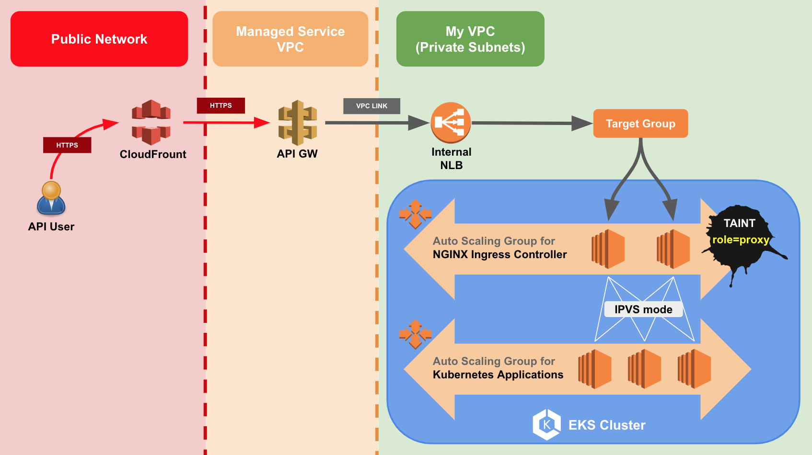

There might be some reasons you want to integrating `AWS API Gateway` with `EKS`:
1. Existing Applications which running on `EC2` or `Lambda` exposing APIs via `API Gateway`, and now you want to put them into `Kubernetes`.
2. You want to leverage the features of `API Gateway` to manage your API users instead of exposing your Kubernetes services by ingress directly.

## Architecture

Thanks to [this tweet](https://twitter.com/pahudnet/status/1030628314044452865) by [Pahud Hsieh](https://twitter.com/pahudnet). I use almost the same architecture to integrate `EKS` with `API Gateway` and it works well. To better understand how and why I set it up, I will address some details of performance tuning in this architecture.

__Focal Points:__
- Place NLB and EKS worker node instances in the private subnets. 
- Setup two worker node groups by custom launchconfigs, one for `NGINX ingress controller` only.
- Setup `NGINX ingress controller` by `Helm` with custom parameters.
- Config `IPVS` mode for `kube-proxy`.

## Everything in the Private Subnets

Except `API Gateway` and `Cloud Front` which are not managed by you.

After you create an EKS cluster and setup worker nodes by [this guide](https://docs.aws.amazon.com/en_us/eks/latest/userguide/getting-started.html). You might find that your worker node instances are launched with public IPs. We will fix it later by customizing launchconfig. Also, check the default `Security Group` on the worker nodes will not allow network traffic from outside of its cluster. If you want to setup a NLB by yourself(not from [Cloud Controller Manager](https://kubernetes.io/docs/tasks/administer-cluster/running-cloud-controller/)), create a `Security Group` and setup `Inbound` rules for the subnets of NLB is required.  

## Setup Two Worker Node Groups

Copy the launchconfig which cloudformation stack created for you.

