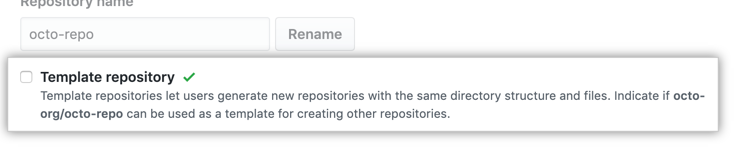

A good source code template beats all training sessions, especially for microservices architecture. One application consists of many microservices. Each microservice is owned by a small team and has its own source code repo. In this case, each small team could do many things alike. Such as test framework, pipeline steps and so on. A source code template with thoughtful structures and examples saves a lot of time on reinventing the wheels. 

## Outline

* [Overview Of A Microservice-Style Application](#OverviewOfAMicroservice-StyleApplication)

## Overview Of A Microservice-Style Application

## What A Microservice Looks Like

## What A Good Template Needs

## How to Manage Deployments
