要改善既有系統（Legacy System）一直以來都不是一件容易的事情，尤其是當面臨要改動整體架構時，需要耗費的時間和人力成本往往讓老闆無法輕易買單。因此，如何評估既有系統並明確指出為什麼要進行改善，以及新的系統架構要如何設計才能面對更大的挑戰，是非常重要的。本篇文章將以 [SRE 課程](https://www.coursera.org/learn/site-reliability-engineering-slos/) 中的評估方法作為主軸進行系統評估，結合 [從零開始學架構](https://www.tenlong.com.tw/products/9787121347917) 和 [大規模數據處理實戰](https://time.geekbang.org/column/intro/167) 兩本書中的知識，總結出一套通用且不會過於複雜的系統改善技巧。

## 大綱

* [學習案例介紹](#學習案例介紹)
    - [案例：轉轉咖啡屋](#案例轉轉咖啡屋)
    - [從單體到微服務](#從單體到微服務)
    - [新的挑戰：更大的規模](#新的挑戰更大的規模)
* [系統評估](#系統評估)
    1. [畫出數據流](#1-畫出數據流)
    2. [標示批處理，流處理](#2-標示批處理流處理)
    3. [定義服務水平指標 SLI](#3-定義服務水平指標)
    4. [上線觀察與校正 (與使用者體驗連動)](#4-上線觀察與校正)
    5. [設定目標 SLO](#5-設定目標)
* [系統改善設計](#系統改善設計)
    1. [SLI 與工具選用](#1-SLI與工具選用)
    2. [範例：改善 Freshness SLI](#2-範例改善FreshnessSLI)
    3. [驗收成果](#3-驗收成果)
* [結語](#結語)

## 學習案例介紹

[從零開始學架構](https://www.tenlong.com.tw/products/9787121347917) 中提到的架構設計三原則：合適、簡單、演化。你不需要在一開始就設計一個技術領先於業界的系統，正所謂『將軍難打無兵之仗』，一開始就投入大量的人力與時間在開發一個高可用、高乘載的系統卻沒有半個使用者，是一點意義也沒有的。所以，設計不良的舊有系統（Legacy System）存在於成功的企業中是常見、正常的狀況。畢竟往往正是因為有了這些符合成本且滿足初期使用者需求的舊有系統，才成就了所謂的成功企業。

### 案例：轉轉咖啡屋

轉轉咖啡屋是一個虛擬的咖啡廳開店平台，提供每一個註冊店家可以在轉轉咖啡屋上開一家屬於自己的咖啡店，並有咖啡配送員幫你將新鮮的咖啡送給消費者。一開始，轉轉咖啡屋做了一個簡單的網站，消費者端有瀏覽店家、咖啡菜單查詢、下單購買、搜尋所有店家菜單等功能。店家端有更新菜單、通知配送員等功能。這個網站使用了單體 + RDBMS 的架構做成如下圖示。過沒多久，轉轉咖啡屋使用者人數一飛沖天，店家數也即將破百。由於搜尋所有店家菜單功能依賴 SQL 查詢關聯式資料庫，效率十分低落，隨著每秒查詢量增加，不但搜尋的速度變慢，還造成 RDBMS 過載，連帶影響到其他功能。

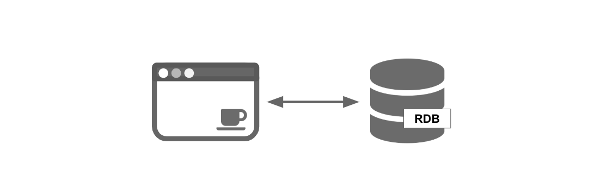

### 從單體到微服務

轉轉咖啡屋唯一的工程師在時間壓力下，決定先將搜尋所有店家菜單功能獨立出來，做成第一個微服務，並使用 [ElasticSearch](https://www.elastic.co/products/elasticsearch) 作為搜尋引擎，改善搜尋效率，並寫了一隻同步程式，每分鐘會將更新資料從 RDB 同步到 ElasticSearch。

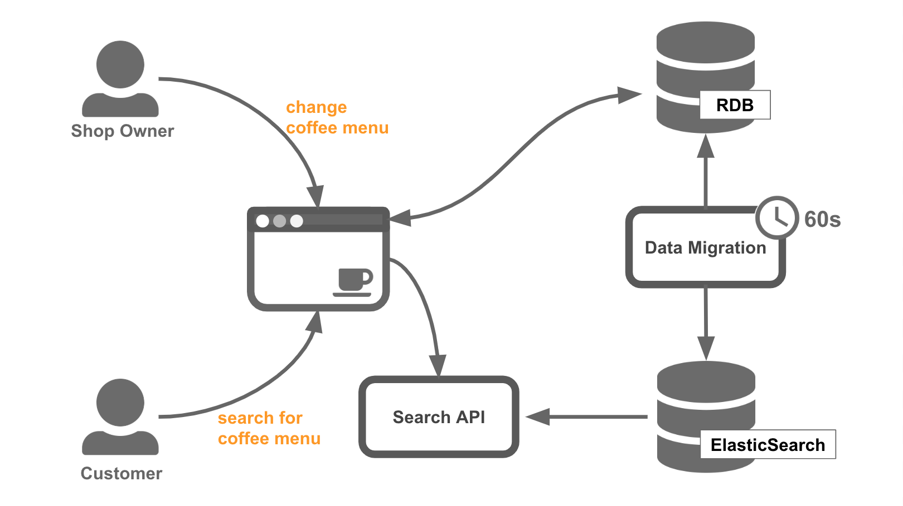

### 新的挑戰：更大的規模

在拆分咖啡搜尋服務之後，解決了搜尋效率問題以及降低了搜尋功能與主要功能之間互相影響的程度。當每秒搜尋次數增加時，也可以單獨的擴充咖啡搜尋服務來應付。

一年過去了，轉轉咖啡屋的店家數量破萬，使用者人數更不用說。由於穩定獲利，轉轉咖啡屋聘請了更多的工程師，也成立了獨立的 SRE 團隊。

此時，咖啡搜尋服務開始出現了一些客戶抱怨，例如：

- 已經下架的咖啡出現在搜尋結果當中。
- 搜尋出現的咖啡價格與實際販售的不一致。

原來，由於個人咖啡店的特色是每個人都可以少量販售，隨時修改咖啡菜單和可販售數量。然而資料是由 RDB 經由中間程式同步到 ElasticSearch 的，隨著店家數量變多，資料量變大，中間同步的時間也漸漸地不斷拉長，導致搜尋結果資訊落差。這些資訊落差，已經嚴重的影響到消費者體驗了。

對於轉轉咖啡屋的 SRE 團隊來說，咖啡搜尋服務這個既有系統，該如何去分析並解決這個問題呢？

## 系統評估

好的，接下來終於可以進入我們今天的主題了。第一步是要對系統進行評估，評估的方法採用 [SRE 服務水平指標](https://www.coursera.org/learn/site-reliability-engineering-slos/home/week/2)（Service Level Indicators, SLIs）的理論，藉由找出關鍵 SLIs 指標，來數據化使用者對於系統的滿意程度。根據 [The properties of good SLI metrics
](https://www.coursera.org/learn/site-reliability-engineering-slos/lecture/pgyZk/the-properties-of-good-sli-metrics) 裡面提到，一個好的 SLI 指標必須真實且直接反應出使用者感受。意即我們可以從一個數值區間為 0%~100% 的 SLI 指標中得知，目前系統某個操作的性能與狀態，是否造成使用者不好的體驗，影響程度與範圍多大。甚至我們可以從數字中換算出客服處理時間，[服務水平指標](https://www.coursera.org/learn/site-reliability-engineering-slos/home/week/2) 越差，代表公司必須付出更多的客服成本，且降低使用者對產品品質的信心。

有了這些數據，我們就可以在改善項目成本與不進行改善所付出的代價之間進行取捨。

通常一個服務根據功能項目多寡和性質，可以定義出多種不同的 SLIs 指標。找出可供改善系統參考的 SLIs 並不容易，在這邊分享一套我自己的做法，供大家參考。

### 1. 畫出數據流

首先，我們要從既有系統當中，辨識出 __數據流__。數據流是新數據進入到系統，經過系統處理到儲存的路徑。簡單來說，我們可以從資料最終的儲存位置反推回去到資料來源，即是一個數據流。如果數據最終的流動方向不是系統資料存儲，這邊我們就不把它當成一個數據流。例如，從資料庫調閱店家簡介回傳給使用者，由於店家簡介這個數據在系統中的存儲內容並沒有變更，故不算在我們的標記範圍(備註：如果這個操作產生了一筆使用者行為紀錄，並儲存在系統某處，就算是一個數據流)。一個簡單的數據流示意圖如下：

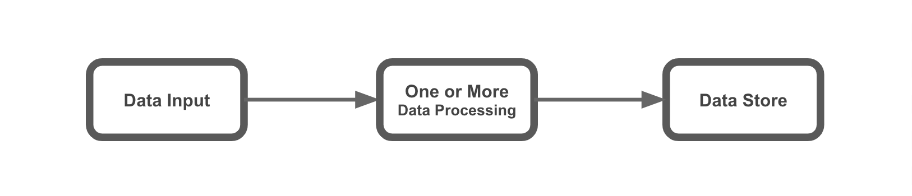

回到前面提到的咖啡搜尋服務範例，更新咖啡菜單這個動作，會產生兩條數據流。一條紅色，由咖啡店長更新菜單產生，最終存儲至 RDB。另一條藍色，由資料同步程式拉取 RDB，並轉換格式存儲於 ElasticSearch。

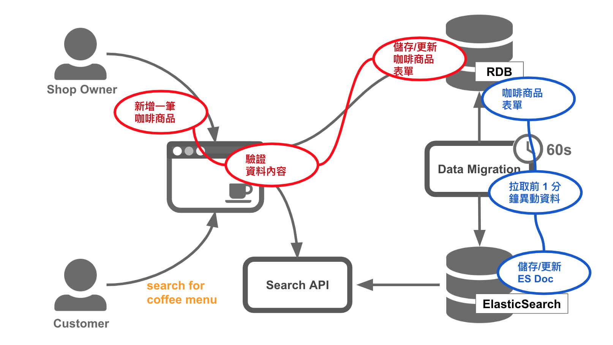

### 2. 標示批處理，流處理

接著，我們需要做的是，標註數據處理的型態，是批處理（Batching Processing）還是流處理（Streaming Processing）。要分辨數據處理的類型我們可以從輸入的數據類型來判斷。

* 輸入的是無邊界數據，我們無法預期什麼時候會停止輸入：__流處理__。
    - 例如，新會員註冊，處理新會員資料時，我們無法得知接下來還有多少人會註冊。可能在接下來的 10 分鐘內會有三個人註冊，也可能一個人也沒有。
* 輸入的是有邊界數據，在一段時間內已經收集保存好的數據：__批處理__。
    - 例如，撈取上個月所有的註冊會員數據，並計算男女比例，再保存成報告資料，預期處理的資料有一定範圍，不會在處理的過程中變多或變少。

再回到前面提到的咖啡搜尋服務範例，我們可以依照前面的規則標示紅、藍兩條數據流是經過了批處理、或是流處理。

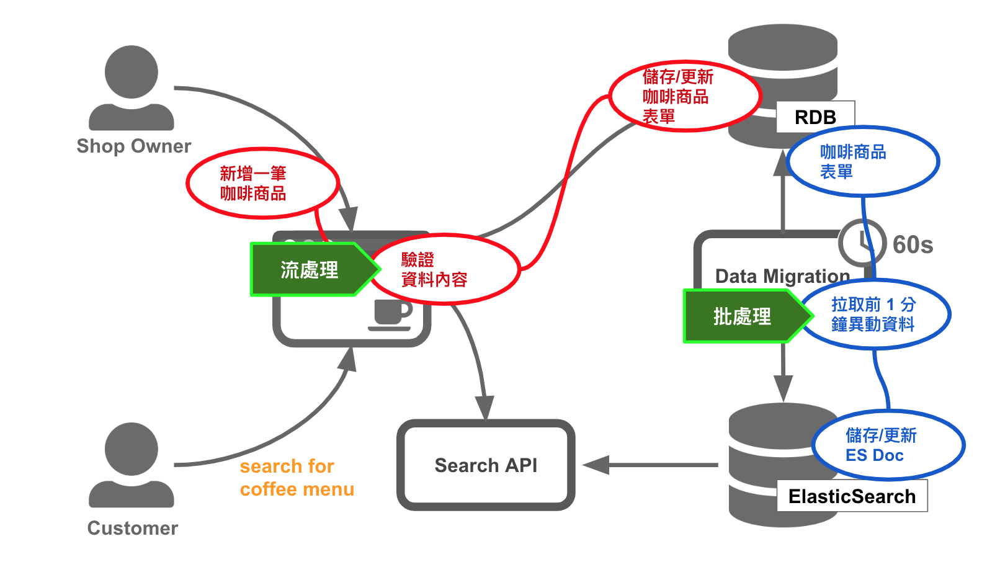

由於咖啡菜單更新這個操作是即時的，一筆一筆進行的，我們可以把它歸類在 __流處理__。而咖啡菜單同步至 ElasticSearch 的數據流，每次處理的是 1 分鐘前到現在的更新資料，具有明確的數據範圍，我們把它歸類在 __批處理__。

### 3. 定義服務水平指標

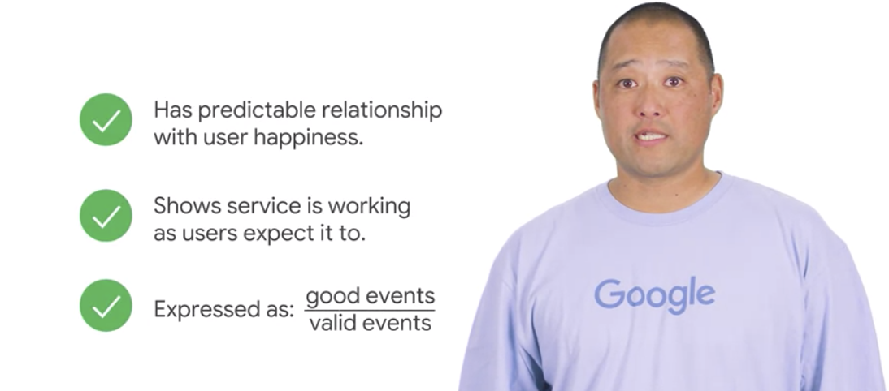

服務水平指標（SLI）必須符合這個公式，SLI = 好的事件/整體合法事件，會是一個 0%~100% 的數值。

在開始定義服務水平指標（SLI）之前，我們先將 __咖啡搜尋服務__ 的微服務邊界劃分清楚。以下綠色區塊的部分便是 __咖啡搜尋服務__ 的守備範圍。有了明確的邊界，就可以列舉出邊界內的系統操作，並針對這些操作定義能反應使用者感受的指標，也就是 SLI。

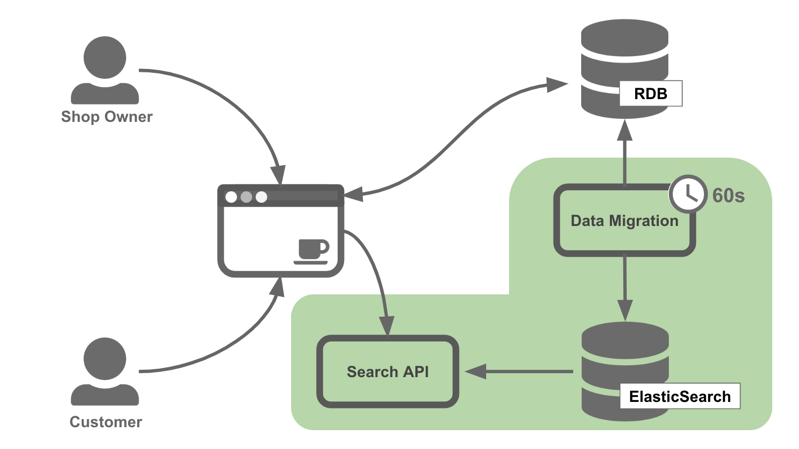

為了節省篇幅，這邊簡單列出兩個 __咖啡搜尋服務__ 的基本操作情境：
1. 查詢咖啡商品
2. 更新咖啡商品數據

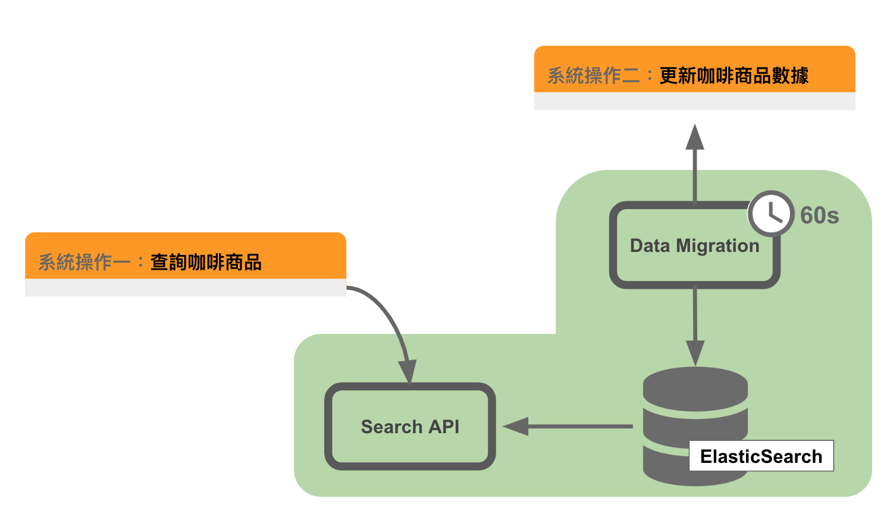

接著我們要挑選適當的 SLI 分別放到這兩個操作當中。幸好，我們已經有現成的工具可以用了，[The SLI Menu](https://www.coursera.org/learn/site-reliability-engineering-slos/lecture/CST0V/the-sli-menu)。Thanks, Google.

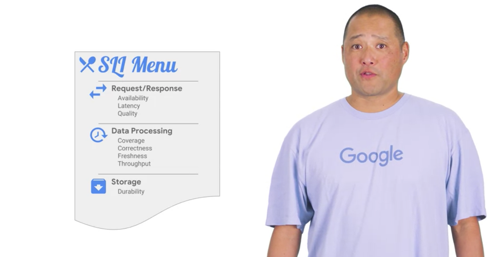

[The SLI Menu](https://www.coursera.org/learn/site-reliability-engineering-slos/lecture/CST0V/the-sli-menu) 是一份 SLI 的參考清單，幾乎包含了大部分的使用情境，請大家安心使用。SLI 參考清單將系統操作情境分成三大類，每個分類底下都有幾個建議使用的 SLI 範本，完整清單如下：

1. [請求/回應（Request/Response）](https://www.coursera.org/learn/site-reliability-engineering-slos/lecture/h4yjq/request-response-slis)
    - 可用性指標（Availability）
    - 回應時間指標（Latency）
    - 回應品質指標（Quality）
2. [數據處理（Data Processing）](https://www.coursera.org/learn/site-reliability-engineering-slos/lecture/TrgBJ/data-processing-slis)
    - 覆蓋率指標（Coverage）
    - 正確性指標（Correctness）
    - 新鮮度指標（Freshness）
    - 吞吐量指標（Throughput）
3. 資料存儲（Storage）
    - 持久性指標（Durability）

在進入 SLI 細節前，我們先替 __咖啡搜尋服務__ 的兩個操作情境做 SLI 分類。這時候前面分析的數據流就派上用場了，__更新咖啡商品數據__ 做的是數據批處理，直接分類在 __2. 數據處理__ 情境。而 __查詢咖啡商品__ 則是典型的 __1. 請求/回應__ 情境（這邊可以使用刪去法來進行選擇，因為不屬於 2. 數據處理 也不屬於 3. 資料存儲）。適合 __3. 資料存儲 SLI__ 的情境目前還沒遇到過，有機會以後再另外做分享，AWS S3 服務是一個例子。

深入 __查詢咖啡商品__ 情境對應的三個指標：

* _可用性指標（Availability）_
    - 定義：合法請求被成功滿足佔整體的比率。
    - 前提：需要先定義何謂 __成功的情境__。
    - 範例：Launch 一台 VM 後可以成功 ssh 連線進去的情況與整體的比率。
* _回應時間指標（Latency）_
    - 定義：合法請求的回應時間低於一個閥值（Threshold）佔整體的比率。
    - 前提：需要先定義回應時間的 __起算點__ 和 __結束點__，以及 __閥值__。
    - 範例：一個 HTTP Request 接收到完整回應內容所需時間少於 500ms 與整體的比率。
* _回應品質指標（Quality）_
    - 定義：合法請求回應非降級的結果佔整體的比率（適用於服務會提供降級結果的情境）。
    - 前提：需要先定義 __正常的結果__ 和 __降級的結果__。
    - 範例：當數據不足時，回應與使用者無關的廣告內容結果與整體的比率。

一開始不需要特別為如何選定適合的指標而煩惱，先憑經驗和感覺來選擇，如果日後發現有不足之處，再補上即可。

__查詢咖啡商品__ 情境目前沒有回應降級結果的設計，故不考慮 __回應品質指標__。而與使用者體驗有關的狀況為 API 回應的 HTTP Code 為 200（成功） 或是 500（系統錯誤）可以納入 __可用性指標__。如果 API 回應的速度過慢也會令使用者感到不適，因此也將 API response time 納入 __回應時間指標__。完整描述參照下圖。

量測位置與方法也是非常重要的部分，當 SLI 無法反應真實情形時，必須重新考慮 SLI 量測位置。在這邊我們使用常見的 Loadbalancer 數據。

深入 __更新咖啡商品數據__ 情境對應的四個指標：
* _覆蓋率指標（Coverage）_
    - 定義：合法輸入數據被成功處理佔整體的比率。
    - 前提：需要先定義哪些數據集會被 SLI 列入考慮，以及怎樣算是 __成功處理__。
    - 備註：這個指標通常用來查看輸入的數據的乾淨程度，被跳過處理的數據的百分比如何。
* _正確性指標（Correctness）_
    - 定義：合法輸入數據產出正確結果佔整體的比率。
    - 前提：需要先定義哪些數據集會被 SLI 列入考慮，以及產出的結果怎樣算是 __正確__。
    - 備註：比較產出是否正確的比較數據必須和數據處理的方法不一致，建議使用已知結果的數據集進行測試。
* _新鮮度指標（Freshness）_
    - 定義：合法輸入數據在一定時間內完成佔整體的比率。
    - 前提：需要先定義哪些數據集會被 SLI 列入考慮，以及從哪個 __時間點__ 開始起算新鮮度。
    - 備註：有時候不一定需要將所有被處理的數據列入 SLI 考量，只計算使用者取到的不新鮮數據更可以反應真實影響。
* _吞吐量指標（Throughput）_
    - 定義：數據處理速率大於某個值佔整體的比率。
    - 前提：需要先定義處理速率的單位，例如，bytes/min。
    - 備註：適合被用在資料處理比較耗時且花費成本的場景。

__更新咖啡商品數據__ 情境的數據處理僅僅是單純地將 RDB 資料轉換成 ElasticSearch Doc 形式，因此針對複雜數據處理的 __正確性指標__ 和 __吞吐量指標__ 先不考慮。__覆蓋率指標__ 或許可以反應資料轉換時格式錯誤的程度，可考慮。為了節省文章篇幅，在這裏選用與前面提到的顧客抱怨相關的 __新鮮度指標__。新鮮度指標依照 __流處理__ 或 __批處理__ 有不同的建議做法。參照如下：

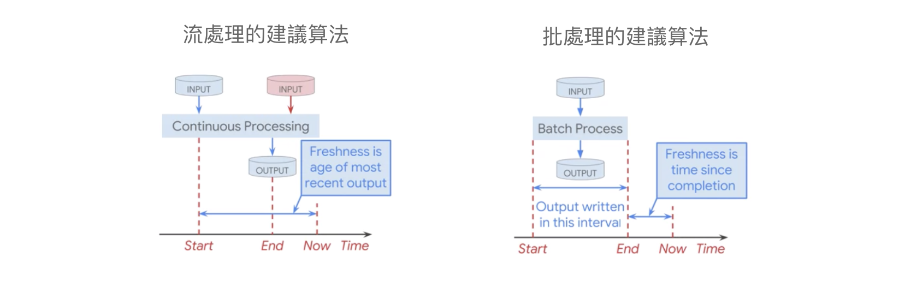

在上一章節我們已經標示出 __更新咖啡商品數據__ 情境是 __批處理__。根據上圖的概念，可以實作如下：

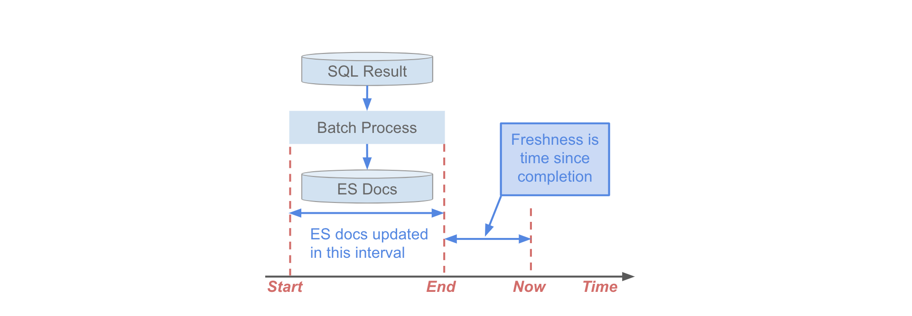

完整描述參照下圖。

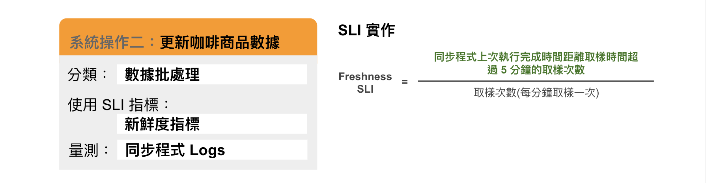

不新鮮的判定先暫時設為 5 分鐘，待日後觀察調整。

定義 SLI 還有許多考量點例如量測視窗大小、量測工具的選擇和 [SLI Refinement](https://www.coursera.org/learn/site-reliability-engineering-slos/lecture/teIhY/refining-sli-specifications) 沒有包含在本篇文章講解範圍內，但是對於評估系統非常有幫助，[學習更多](https://www.coursera.org/learn/site-reliability-engineering-slos/home/week/3)。

### 4. 上線觀察與校正

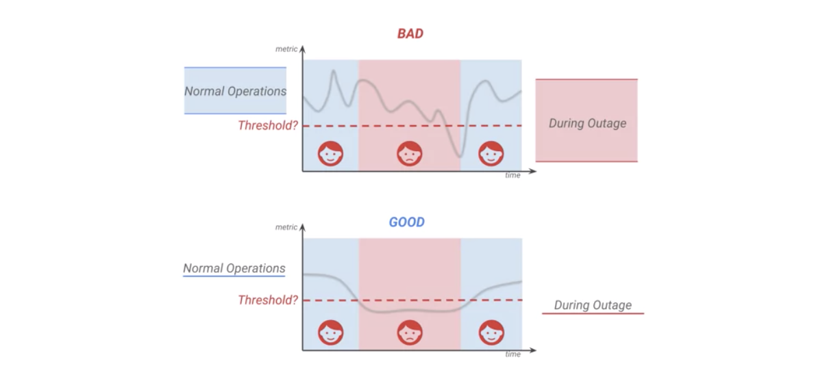

有了 SLI，現在我們可以使用量化的方式觀察系統的滿意程度。但是我們還不知道 SLI 數值與實際使用者的影響程度之間的關聯。

Freshness SLI = 99% 代表什麼意思？

有沒有可能設定的資料新鮮度條件為 5 分鐘，實際上每次取樣結果都是 4 分半，計算出來的 SLI ＝ 100%。而使用者仍然不開心，這時候就要下修條件，直到 SLI 可以反應真實使用體驗為止。同理 Latency SLI 的 500ms 條件是否太長或太短，也是需要收集使用者反饋再進行調整。

收集使用者反饋（Feedback）可以從客服部門的統計資料取得，或是在 client 端加上回報問題的按鈕，讓內部測試人員操作也是不錯的辦法。無論如何，提升 SLI 與使用者感受的連動性，是非常重要的。

### 5. 設定目標

盤點一下目前為止我們有的 SLI 指標，以及 30 天觀測結果（假設我們已經做了）：

* _查詢咖啡商品_
    - Availability SLI
        - __99.13%（30天）__
    - Latency SLI
        - __98.6%（30天）__
    - 客戶抱怨次數：0 次
* _更新咖啡商品數據_
    - Freshness SLI
        - __82%（30天）__
    - 客戶抱怨次數：5 次

第一次定義 __服務水平目標__（Service Level Objectives）時，我們可以拿過去的一個月的數據作為基準，再打一點折。

**保守型 SLOs**，維持現狀就是你的目標。適合運行穩定、較少客服處理的情境。下個月只要能達到這個數字，代表一切相安無事。
- _Coffe Search Availability SLO_
    - __98%（30天）__
- _Coffe Search Latency SLO_
    - __96%（30天）__

**改善型 SLOs**，提升數字是你的目標。提升數字意味著必須針對系統進行改善，為了在下個月能達成目標。視系統複雜程度而定，通常不建議在短時間內設立很大的目標，例如：__80%__ -> __95%__。這樣一來為了達成目標，在接下來的 30 天就必須投入大量的人力。如果一直無法達成目標，SLO 形同虛設。
- _Coffe Menu Update Freshness SLO_
    - __82%（30天）__ -> __90%（30天）__。
    - 如果能達成目標，預期可以減少 (90 - 82) / (100 - 82) = __44.4%__ 的客服量。

設立 SLO 的好處除了可以幫助進行改善系統的決策，也提供了下個月維運的 [錯誤預算(Error Budget)](https://www.coursera.org/learn/site-reliability-engineering-slos/lecture/ApmoO/why-an-error-budget-policy)。

[錯誤預算(Error Budget)](https://www.coursera.org/learn/site-reliability-engineering-slos/lecture/ApmoO/why-an-error-budget-policy) 讓你可以在已經達標的系統上，有犯錯的空間以進行機器維運、部署新版本、或異常演練等工作。

__Error Budget__ = __目前 SLI__ - __SLO__ (例：Coffe Search Latency Error Budget ＝ 99% - 96% = 3%) 

Error Budget 也可以用來評估系統維運風險，當你的 Error Budget 已經等於 0% 或小於 0% 時。在接下來的日子裡，你很有可能即將面臨接不完的電話，和不斷流失的客戶。

## 系統改善設計

服務水平目標（SLI）量化了系統當前的狀態。服務水平目標（SLO）讓我們有更明確的方法在改善與不改善之間做權衡判斷。接下來我們繼續使用 SLI 種類的特性來選用系統改善的做法。

### 1. SLI 與工具選用

還記得 [The SLI Menu](https://www.coursera.org/learn/site-reliability-engineering-slos/lecture/CST0V/the-sli-menu) 嗎？要改善的 SLI 都有屬於自己的類型。例如，__請求/回應__ 的 __回應時間指標__。

如果想要提升的是 __回應時間指標__，可以參考 [從零開始學架構](https://www.tenlong.com.tw/products/9787121347917) 的 __高性能架構模式__。

如果想要提升的是 __可用性指標__，可以參考 [從零開始學架構](https://www.tenlong.com.tw/products/9787121347917) 的 __高可用架構模式__。

數據處理類型的 SLI，則可以參考 [工作流設計模式（Workflow Pattern）](https://time.geekbang.org/column/article/92928)。

__工作流設計模式__ 有以下模式：

* 複製模式(Copier Pattern)
    - 將單一數據來源，完整的複製到其他多個數據處理模塊，使同樣數據可以同時被不同用途功能處理。
    - 範例：一個 Youtube 影片上傳後，影片內容同時分給縮圖產生器、內容審核器、高解析度格式轉換、低解析度格式轉換等處理器同時處理。
* 過濾模式(Filter Pattern)
    - 數據集通過過濾處理模塊，只留下符合條件的數據。
    - 範例：發送優惠通知時，只發送給 VIP 會員。從會員庫塞選出 VIP 會員清單。
* 分離模式(Splitter Pattern)
    - 處理數據集時不想丟器任何數據，而是將數據分類丟到不同的工作流處理。
    - 範例：承上面的例子，想要依照不同的會員等級發送不同的優惠內容時，同時分離出 VIP 會員和普通會員到不同清單中。
* 合併模式(Joiner Pattern)
    - 將多個不同數據來源合併再一起，統一由一個工作流處理。
    - 範例：使用爬蟲取得 Instgram 圖片與 Facebook 圖片，合併在一起做圖像處理。

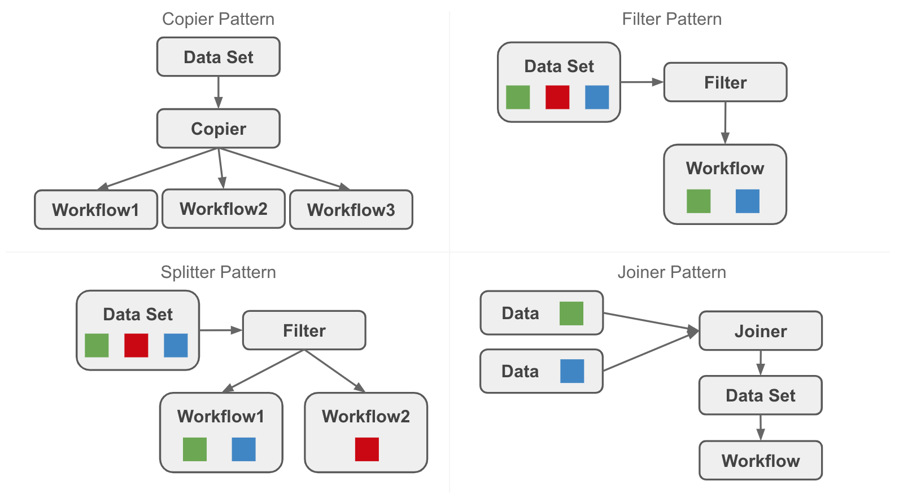

### 2. 範例：改善 Freshness SLI

我們重新來檢視一下 __更新咖啡商品數據__ 和其相關的數據流。

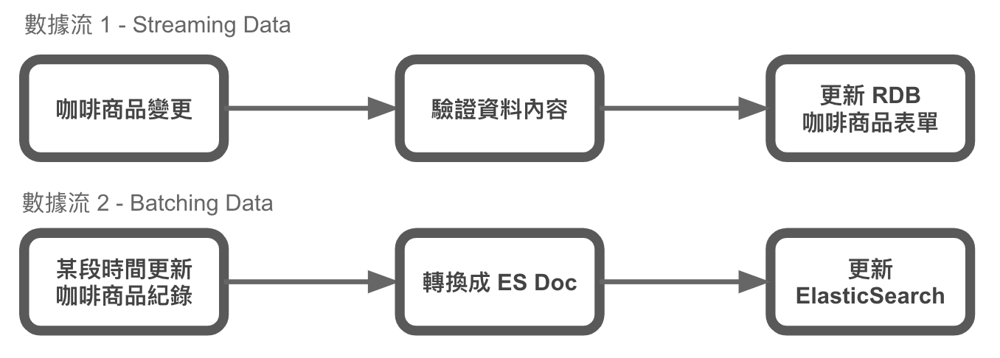

可以發現相同的數據來源，卻分成了兩條不同的工作流。有沒有可能使用 __工作流設計模式__ 的其中之一，將這兩條數據流合併呢？例如，使用 __Copier Pattern__。

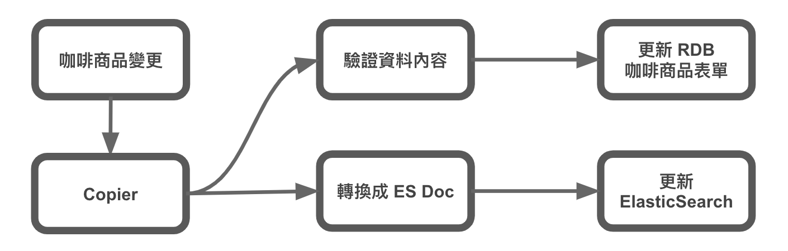

採用 Copier Pattern 後，會發現資料來源統一了，但是多了一個 Copier 節點。Copier 節點要如何去實作，也是一個值得探討的問題。Copier 節點必須具備單一輸入扇形輸出(fan out)的特性，聽起來是不是很像單一來源的 __發布/訂閱（Pub/Sub)__ 模式呢？如果要實作 Pub/Sub，那選擇就很多了，如 GCP Cloud Pub/Sub, Apache Kafka, AWS SNS + SQS, Redis 等等。

想必大家在實作方面都有自己獨門的見解和建議，在這裡我就不講出來讓人見笑了。本篇文章的主軸還是在如何使用 SRE 方法引導出系統改善的方向。

### 3. 驗收成果

經過了上一章節的架構調整，我們可以觀察原本定義好的 Freshness SLI 數值變化來驗收成果。

如果，因為架構調整而使原本的 SLI 無法收集到資料，那可能要思考看看是不是 SLI 定義或是量測方式有需要調整的部分。以 __更新咖啡商品數據__ 情境為例，中間做數據處理的程式邏輯仍然是轉換資料格式，轉換完成後寫入一樣的完成時間到一樣的 log 位置，即使接收數據的方式可能改變（SQL 結果 -> Message）。但是被量測的部分並沒有受到影響。

當然 SLI 也並不是一直不變的。我們應該遵循一次只改動一個地方的原則來比較成果。修改 SLI 時不改動系統，改動系統時不修改 SLI。如此才能得到可以被比較的前後結果。

## 結語

從 SRE 的觀點來操作系統改善這件事，有助於釐清改善的關鍵點。同時避免依賴經驗主義導致過度設計的陷阱。

另一方面，改善的結果也可以很明確地看出成果。甚至在改善的過程中，也不斷地觀察著 SLI 變化，對於複雜系統需要一步一步改善的過程，也可以持續地得到回饋。或許，我們再也不需要摸黑前進了吧。